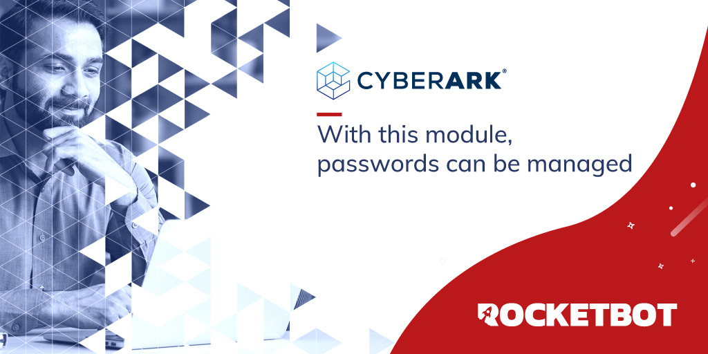

# Cyberark
  
Module to connect to Cyberark and manage passwords

*Read this in other languages: [English](Manual_Cyberark.md), [Portugues](Manual_Cyberark.pr.md), [Español](Manual_Cyberark.es.md).*
  

## How to install this module
  
__Download__ and __install__ the content in 'modules' folder in Rocketbot path  

## Description of the commands

### Configure Cyberark credentials
  
Configure credentials to connect to the Cyberark API.
|Parameters|Description|example|
| --- | --- | --- |
|User|User to connect to the Cyberark API|User|
|Password|Password to connect to the Cyberark API|********|
|URL|URL of the Cyberark API|https://cyberark.example.com|
|Assign result to variable|Assign connection result to variable|result|

### Get all Safes
  
Get all Safes from the CyberArk Vault
|Parameters|Description|example|
| --- | --- | --- |
|Filter by name|Filter the result by the name of the Safe|name|
|Number of results|Maximum number of results that will be returned in the variable|25|
|Assign result to variable|Assign result to variable|result|

### Get Safe
  
Get information about a specific Safe in the Vault.
|Parameters|Description|example|
| --- | --- | --- |
|Safe ID|Safe URL ID|123456|
|Assign result to variable|Assign result to variable|result|

### Add Safe
  
Adds a new Safe to the Vault. The user must have Add Safes permissions in the Vault.
|Parameters|Description|example|
| --- | --- | --- |
|Safe Name|Name of the new Safe|SAFE-1|
|Safe Description|Description of the new Safe|Test Safe|
|Safe Location|Location of the new Safe. By default it is the root path.|//|
|Assign result to variable|Assign result to variable|result|

### Update Safe
  
Update a single Safe in the Vault from CyberArk
|Parameters|Description|example|
| --- | --- | --- |
|Safe ID|Safe ID to update|123456|
|New Safe name|New name that will be assigned to the Safe|NEW-NAME|
|New Safe description|New description that will be assigned to the Safe|NEW-DESCRIPTION|
|New Safe location|New location that will be assigned to the Safe|//|
|Assign result to variable|Assign result to variable|result|

### Delete Safe
  
Delete Safe from the Vault
|Parameters|Description|example|
| --- | --- | --- |
|Safe ID|Safe URL ID|123456|
|Assign result to variable|Assign result to variable|result|

### Get all Accounts
  
Get a list of all the accounts in the Vault
|Parameters|Description|example|
| --- | --- | --- |
|Filter by name|Filter the result by the name of the account|name|
|Number of results|Maximum number of results that will be returned in the variable|25|
|Assign result to variable|Assign result to variable|result|

### Get Account
  
Get information about an account identified by its ID
|Parameters|Description|example|
| --- | --- | --- |
|Account ID|Account ID|123456|
|Assign result to variable|Assign result to variable|result|

### Add Account
  
Add a new privileged account or SSH key to the Vault
|Parameters|Description|example|
| --- | --- | --- |
|Account name|Name that will have the created account|Name|
|PlatformId|Platform identifier assigned to the account|WinServerLocal|
|Safe name|Name of the safe where the account will be located|SAFE-1|
|Secret type|Secret type that will be stored in the account|key|
|Secret|Secret that will be stored in the account|********|
|Assign result to variable|Assign result to variable|result|

### Delete Account
  
Delete an account from the Vault
|Parameters|Description|example|
| --- | --- | --- |
|Account ID|Account ID that will be deleted|123456|
|Assign result to variable|Assign result to variable|result|

### Generate password
  
Generate a new password for an existing account. The password is generated according to the password policy defined in the target system.
|Parameters|Description|example|
| --- | --- | --- |
|Account ID|Account ID that will be deleted|123456|
|Assign result to variable|Assign result to variable|result|

### Get password value
  
Retrieve the password or SSH key of an existing account that is identified by its Account ID.
|Parameters|Description|example|
| --- | --- | --- |
|Account ID|Account ID that will be deleted|123456|
|Assign result to variable|Assign result to variable|result|

### Get password from Central Credential Provider
  
Enable applications to retrieve secrets from the Central Credential Provider
|Parameters|Description|example|
| --- | --- | --- |
|URL|Central Credential Provider URL|100.10.2|
|Port|Server port|22|
|AppID|Specifies the unique ID of the application issuing the password request.|BillingApp|
|Safe name|Specifies the name of the Safe where the password is stored.|SAFE-NAME|
|Folder|Specifies the folder where the password is stored.|BILLING|
|Object|Specifies the name of the password object to retrieve.|MonthlyBilling|
|User Name|Defines search criteria according to the assigned username account property.|user|
|Assign result to variable|Assign result to variable|result|
